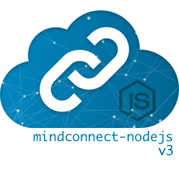
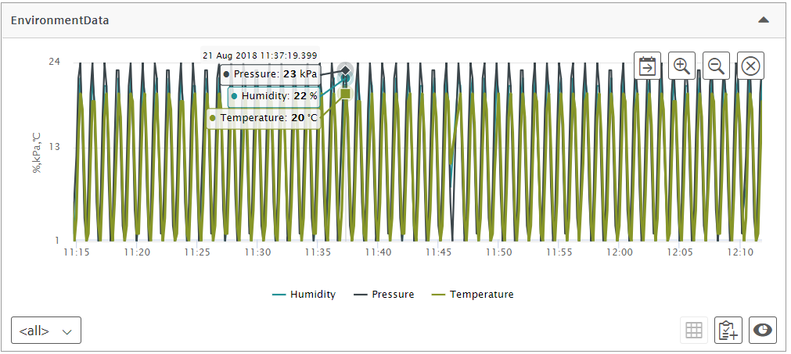
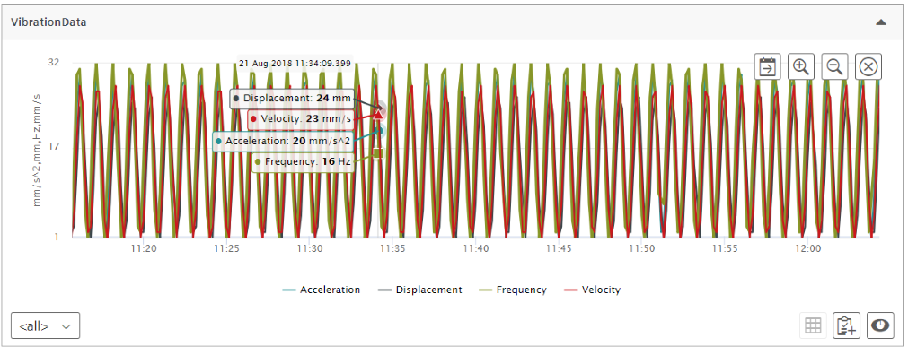
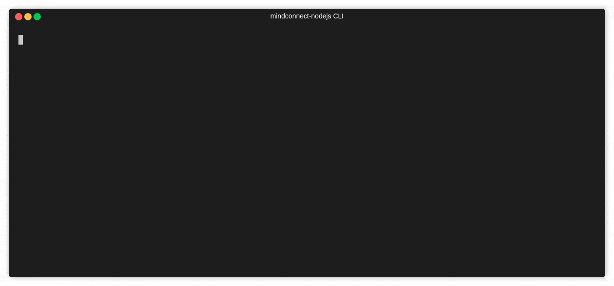

# MindConnect-NodeJS

## nodejs library for the MindConnect API (V3)



The mindconnect-nodejs library enables the user to upload time series data, files and events to Siemens MindSphere Platform.

This project has started as a community effort at Siemens AG and is now available for general use.

[](https://jenkins.mindconnect.rocks/job/mindconnect-nodejs/job/cicd/)

## Installing the library

There are several ways to install the library. The most common one is via npm registry:

```bash
# install the library from registry (npmjs.org)
npm install @mindconnect/mindconnect-nodejs
```

As an alternative, you can also clone the repository, pack and install the files from local file:

``` bash
# clone the repository and run in the library directory
npm install
npm pack

#this creates a mindconnect-....tgz file
# in your project directory run
npm install mindconnect-...tgz --save
```

## Installing the Command Line Interface

The library comes with a command line interface which can also be installed globally. You can use the command line mode to upload timeseries, files and create events in the mindsphere.

```bash
# install the library globaly if you want to use its command line interface.
 npm install -g @mindconnect/mindconnect-nodejs

# or from the local file
 npm install -g mindconnect-...tgz
```


## Using generator for the project

```bash
# 1. clone this repository
git clone git@code.siemens.com:mindsphere-mainline/incubator/mindconnect-nodejs.git

# 2. install depencencies
npm install
# 3.1 for typescript nodejs project run
npm run starterts

# 3.2 for javascript nodejs project run
npm run starterjs

# This will create a folder starterts (or starterjs) which you can use as a starting point for your agent. Don't forget to run npm install there :)
```

## How to create a nodejs MindSphere agent

The following steps describe the easiest way to test the library. You can of course create the required dependencies also programmatically via API calls.

### Step 0: Create an asset type and aspect types

Mindsphere V3 IoT model requires that you create an asset type and aspect types to describe your assets. For the example we will create an asset type of type Engine with two aspect types: Environment and Vibration. (Note that my tenant is called castidev, you will have to use your own tenant name)


### Step 1: Create an asset

Create an asset (In example it is called **AcmeMotor**) of type Engine in AssetManager for your data.

### Step 2: Create an agent of type MindConnectLib in Mindsphere

Create an agent in Asset Manager of type core.MindConnectLib create initial JSON token and store it to file (e.g. agentconfig.json)

```json
{
    "content": {
        "baseUrl": "https://southgate.eu1.mindsphere.io",
        "iat": "<yourtokenishere>",
        "clientCredentialProfile": [
            "SHARED_SECRET"
        ],
        "clientId": "a3ac5ae889544717b02fa8282a30d1b4",
        "tenant": "<yourtenantishere>"
    },
    "expiration": "2018-04-06T00:47:39.000Z"
}
```

### Step 3 : Create an agent

Read the initial configuration from the config file and create the agent.
If you are using the **SHARED_SECRET** profile there is no need to setup the local certificate for the communication (recommended for smaller devices).

```typescript
    const configuration = require("../../agentconfig.json");
    const agent = new MindConnectAgent(configuration);
```

 If you want to use the **RSA_3072** profile you must also set up the agent certificate.

```typescript
// you can create the private.key for example using openssl:
// openssl genrsa -out private.key 3072

agent.SetupAgentCertificate(fs.readFileSync("private.key"));
```

### Step 4: Onboard the agent

The first operation is onboarding of the agent. This creates a client secret which is used for the communication with mindshpere.

This data is stored by default in the .mc folder in your application if you don't change the base path in the constructor of the agent.

**Important**: Make sure that your folder with the configurations is not reachable from the internet as it contains the client_secret for the authentication.

```typescript
if (!agent.IsOnBoarded()) {
    await agent.OnBoard();
}
```

### Step 5: Configure the data model and data mappings to asset variables. (via UI)

In the mindsphere  version 3 you can configure the data model and mappings to aspect variables in the UI of the asset manager as well. Just go to configuration of mindconnectlib and configure the data sources like this.


(it might be a bit tedious to click through all mappings).

After that you can pull the configuration from mindsphere.

```typescript
if (!agent.HasDataSourceConfiguration()) {
    await agent.GetDataSourceConfiguration();
}
```

### Step 6 After this you can send the data in the code

```typescript
for (let index = 0; index < 5; index++) {

    const values: DataPointValue[] = [
        { "dataPointId": "DP-Temperature", "qualityCode": "0", "value": (Math.sin(index) * (20 + index % 2) + 25).toString() },
        { "dataPointId": "DP-Pressure", "qualityCode": "0", "value": (Math.cos(index) * (20 + index % 25) + 25).toString() },
        { "dataPointId": "DP-Humidity", "qualityCode": "0", "value": ((index + 30) % 100).toString() },
        { "dataPointId": "DP-Acceleration", "qualityCode": "0", "value": (1000.0 + index).toString() },
        { "dataPointId": "DP-Frequency", "qualityCode": "0", "value": (60.0 + (index * 0.1)).toString() },
        { "dataPointId": "DP-Displacement", "qualityCode": "0", "value": (index % 10).toString() },
        { "dataPointId": "DP-Velocity", "qualityCode": "0", "value": (50.0 + index).toString() }
    ];

    // there is an optional timestamp parameter if you need to use something else instead of Date.now()
    const result = await agent.PostData(values);
}
```

(If you were using UI to configure data mappings you will have long integers instead of human-readable data point Ids.)

### Step 6.1 using bulk upload

If you don't want to send the data points one by one, you can also use the bulkpostdata method

```typescript
const bulk: TimeStampedDataPoint[] =
    [{
        "timestamp": "2018-08-23T18:38:02.135Z",
        "values":
            [{ "dataPointId": "DP-Temperature", "qualityCode": "0", "value": "10" },
            { "dataPointId": "DP-Pressure", "qualityCode": "0", "value": "10" }]
    },
    {
        "timestamp": "2018-08-23T19:38:02.135Z",
        "values": [{ "dataPointId": "DP-Temperature", "qualityCode": "0", "value": "10" },
        { "dataPointId": "DP-Pressure", "qualityCode": "0", "value": "10" }]
    }];

await agent.BulkPostData (bulk);
```

## Events

Events can now be created with the library. You can create events for your agent or for your entities. In order to create an event for your entity you need to know the asssetid of the asset.

```javascript
const configuration = require("../../agentconfig.json");
const agent = new MindConnectAgent(configuration);

if (!agent.IsOnBoarded()) {
    await agent.OnBoard();
}

const event: MindsphereStandardEvent = {
    "entityId": configuration.content.clientId, // use assetid if you dont want to store event in the agent :)
    "sourceType": "Event",
    "sourceId": "application",
    "source": "Meowz",
    "severity": 20, // 0-99 : 20:error, 30:warning, 40: information
    "timestamp": new Date().toISOString(),
    "description": "Test"
};

// send event with current timestamp
await agent.PostEvent(event);
```


## File Upload

Files can now be uploaded via the library. You can upload files for your agent or for your entities. In order to create an event for your entity you need to know the assetid of the asset.

The file upload will automatically chunk your files if they are bigger then 8MB. This feature is **experimental** and can be switched off with a parameter.

```javascript
const configuration = require("../../agentconfig.json");
const agent = new MindConnectAgent(configuration);

if (!agent.IsOnBoarded()) {
    await agent.OnBoard();
}

// see generated documentation for full docs
await agent.Upload("package.json", "application/json", "Demo File");

```


## Full Agent

Here is a demo agent implementation.

 [](src/demoagent/test-agent.ts)

## Making sure that the data arrives also with flaky internet connection

You can wrap all asynchronous object calls into the retry function which will automatically retry the operation for n times before throwing an exception.

```typescript
import { MindConnectAgent, MindsphereStandardEvent, retry, TimeStampedDataPoint } from "@mindconnect/mindconnect-nodejs";

// if you want to be more resillient you can wrap every async method
// in the retry function which will try to retry several times before throwing an exception

// onboarding over flaky connection
await retry (5, ()=>agent.OnBoard())

// bulk upload with 5 retries
const bulk: TimeStampedDataPoint[] =
[{
    "timestamp": "2018-08-23T18:38:02.135Z",
    "values":
        [{ "dataPointId": "DP-Temperature", "qualityCode": "0", "value": "10" },
        { "dataPointId": "DP-Pressure", "qualityCode": "0", "value": "10" }]
},
{
    "timestamp": "2018-08-23T19:38:02.135Z",
    "values": [{ "dataPointId": "DP-Temperature", "qualityCode": "0", "value": "10" },
    { "dataPointId": "DP-Pressure", "qualityCode": "0", "value": "10" }]
}];

await retry(5, () => agent.BulkPostData(bulk));

```

## Generating the documentation

You can always generate the current HTML documentation by running the command below.

```bash
#this generates a docs/ folder the with full documentation of the library.
npm run doc
```

## Proxy support

Set the http_proxy or HTTP_PROXY environment variable if you need to connect via proxy.

```bash
# set http proxy environment variable if you are using e.g. fiddler on the localhost.

export HTTP_PROXY=http://localhost:8888
```

## Data in the mindsphere

Environment data:



Vibration data:



## Bonus: Setup and diagnostic

The diagnostic endpoint gives informations about the possible problems which an agent might have on the cloud side. However, these operations require service credentials which should only be used for setup and diagnostic tasks in secure environments.

### Using setup and diagnostic from CLI

**Use this only in secure enviroments! (e.g on your working station, not on the agents)**



### Using setup and diagnostic from code

You can use setup and diagnostic from code like this:

```typescript
// don't do this on the agents!
const setup = new MindConnectSetup ("https://gateway.eu1.mindsphere.io", "Basic: <base64encodedauth>", "mytenant");
await mcsetup.RegisterForDiagnostic("0-agentid-00000000000000000000");
await mcsetup.GetDiagnosticInformation("0-agentid-00000000000000000000");
await mcsetup.DeleteDiagnostic("0-agentid-00000000000000000000");
```

## Legal

This project has been released under an [Open Source license](./LICENSE.md). The release may include and/or use APIs to Siemens’ or third parties’ products or services. In no event shall the project’s Open Source license grant any rights in or to these APIs, products or services that would alter, expand, be inconsistent with, or supersede any terms of separate license agreements applicable to those APIs. “API” means application programming interfaces and their specifications and implementing code that allows other software to communicate with or call on Siemens’ or third parties’ products or services and may be made available through Siemens’ or third parties’ products, documentations or otherwise.
