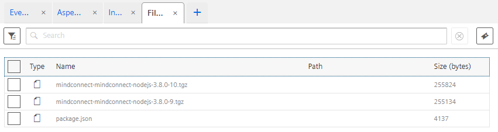

<!-- markdownlint-disable MD033 MD041 -->
<p align="center">

</p>
<h1 align="center">MindConnect-NodeJS</h1>
<p align="center">
<a href="#getting-started">NodeJS Library for MindSphere Connectivity</a> - <a href="#mindsphere-typescript-sdk">TypeScript SDK for MindSphere</a> - <a href="#command-line-interface">MindSphere Command Line Interface</a> - <a href="#mindsphere-development-proxy">MindSphere Development Proxy</a>

<!-- markdownlint-enableMD033 -->

[](https://github.com/mindsphere/mindconnect-nodejs/actions/workflows/build.yml) [](./LICENSE.md)
[](https://www.npmjs.com/package/@mindconnect/mindconnect-nodejs) 
[](https://lgtm.com/projects/g/mindsphere/mindconnect-nodejs/context:javascript)
[](https://opensource.mindsphere.io/docs/mindconnect-nodejs/index.html)
[](https://opensource.mindsphere.io/docs/mindconnect-nodejs/sdk/index.html)
[](https://opensource.mindsphere.io/docs/mindconnect-nodejs/cli/index.html)
[](https://community.plm.automation.siemens.com/t5/Developer-Space/bd-p/MindSphere-platform-forum) [](https://siemens.mindsphere.io/en/start) [](#community)  [](https://github.com/mindsphere/mindconnect-nodejs/releases/latest)

</p>

## Full documentation

The full documentation can be found at [https://opensource.mindsphere.io/docs/mindconnect-nodejs/index.html](https://opensource.mindsphere.io/docs/mindconnect-nodejs/index.html)

## Installing the library

There are several ways to install the library. The most common one is via npm registry:

```bash
# install the latest stable library from the npm registry
npm install @mindconnect/mindconnect-nodejs --save
# install the latest alpha library from the npm registry
npm install @mindconnect/mindconnect-nodejs@alpha --save
```

## Getting started

[](https://opensource.mindsphere.io/docs/mindconnect-nodejs/cli/index.html)

The easiest way to start is to use the provided command line interface to create a starter project:

```bash
# for typescript nodejs project run
npx @mindconnect/mindconnect-nodejs starter-ts

# for javascript nodejs project run
npx @mindconnect/mindconnect-nodejs starter-js
```

## How to create a nodejs MindSphere agent

The following steps describe the easiest way to test the library. You can of course create the required dependencies also programmatically via API calls.

### Step 0: Create an asset type and aspect types

MindSphere V3 IoT model requires that you create an asset type and aspect types to describe your assets. For the example we will create an asset type of type Engine with two aspect types: Environment and Vibration. (Note that my tenant is called castidev, you will have to use your own tenant name)


More information about [MindSphere Data Model](https://siemens.mindsphere.io/en/docs/tutorials/asset-manager).

### Step 1: Create an asset

Create an asset (In example it is called **AcmeMotor**) of type Engine in AssetManager for your data.

### Step 2: Create an agent of type MindConnectLib in MindSphere

Create an agent in Asset Manager of type core.MindConnectLib create initial JSON token and store it to file (e.g. agentconfig.json)

```json
{
    "content": {
        "baseUrl": "https://southgate.eu1.mindsphere.io",
        "iat": "<yourtokenishere>",
        "clientCredentialProfile": [
            "SHARED_SECRET"
        ],
        "clientId": "a3ac5ae889544717b02fa8282a30d1b4",
        "tenant": "<yourtenantishere>"
    },
    "expiration": "2018-04-06T00:47:39.000Z"
}
```

### Step 3 : Create an agent

Read the initial configuration from the config file and create the agent.
If you are using the **SHARED_SECRET** profile there is no need to setup the local certificate for the communication (recommended for smaller devices).

```typescript
    const configuration = require("../../agentconfig.json");
    const agent = new MindConnectAgent(configuration);
```

 If you want to use the **RSA_3072** profile you must also set up the agent certificate.

```typescript
// you can create the private.key for example using openssl:
// openssl genrsa -out private.key 3072

agent.SetupAgentCertificate(fs.readFileSync("private.key"));
```

### Step 4: Onboard the agent

The first operation is onboarding of the agent. This creates a client secret which is used for the communication with MindSphere.

This data is stored by default in the .mc folder in your application if you don't change the base path in the constructor of the agent.

**Important**: Make sure that your folder with the configurations is not reachable from the internet as it contains the client_secret for the authentication.

```typescript
if (!agent.IsOnBoarded()) {
    await agent.OnBoard();
}
```

### Step 5: Configure the data model and data mappings to asset variables. (via code)

**Important**: From the version 3.8.0 it is possible to create the data source configuration and data mappings fully automatic via code

First you need to create a data source configuration

```typescript
// create data source configuration for an asset type castidev.Engine
const generatedConfig = await agent.GenerateDataSourceConfiguration(`${agent.GetTenant()}.Engine`);
await agent.PutDataSourceConfiguration(generatedConfig);
```

and then the data mappings:

```typescript
const mappings = await agent.GenerateMappings(targetAssetId);
await agent.PutDataMappings(mappings);
```

The agents have now access to MindSphere TypeScript SDK (in beta)

```typescript
agent.Sdk();
// the sdk gives you access to e.g. asset management client with which you can get asset types or assets from mindsphere
// which can be used for automatic data source configuration and automatic mappings

const assetMgmt = agent.Sdk().GetAssetManagementClient();
await assetMgmt.GetAssets(...);
await assetMgmt.GetAspectTypes(...);

```

If you take a look at the MindSphere configuration of your agent now it should look like this:


And the data mappings should be in place


### Step 6 After this you can send the data in the code

```typescript
for (let index = 0; index < 5; index++) {

    const values: DataPointValue[] = [
        { "dataPointId": "DP-Temperature", "qualityCode": "0", "value": (Math.sin(index) * (20 + index % 2) + 25).toString() },
        { "dataPointId": "DP-Pressure", "qualityCode": "0", "value": (Math.cos(index) * (20 + index % 25) + 25).toString() },
        { "dataPointId": "DP-Humidity", "qualityCode": "0", "value": ((index + 30) % 100).toString() },
        { "dataPointId": "DP-Acceleration", "qualityCode": "0", "value": (1000.0 + index).toString() },
        { "dataPointId": "DP-Frequency", "qualityCode": "0", "value": (60.0 + (index * 0.1)).toString() },
        { "dataPointId": "DP-Displacement", "qualityCode": "0", "value": (index % 10).toString() },
        { "dataPointId": "DP-Velocity", "qualityCode": "0", "value": (50.0 + index).toString() }
    ];

    // there is an optional timestamp parameter if you need to use something else instead of Date.now()
    const result = await agent.PostData(values);
}
```

(If you were using UI to configure data mappings you will have long integers instead of human-readable data point Ids.)

### Step 6.1 using bulk upload

If you don't want to send the data points one by one, you can also use the BulkPostData method

```typescript
const bulk: TimeStampedDataPoint[] =
    [{
        "timestamp": "2018-08-23T18:38:02.135Z",
        "values":
            [{ "dataPointId": "DP-Temperature", "qualityCode": "0", "value": "10" },
            { "dataPointId": "DP-Pressure", "qualityCode": "0", "value": "10" }]
    },
    {
        "timestamp": "2018-08-23T19:38:02.135Z",
        "values": [{ "dataPointId": "DP-Temperature", "qualityCode": "0", "value": "10" },
        { "dataPointId": "DP-Pressure", "qualityCode": "0", "value": "10" }]
    }];

await agent.BulkPostData (bulk);
```

## Events

Events can now be created with the library. You can create events for your agent or for your entities. In order to create an event for your entity you need to know the assetId of the asset.

```javascript
const configuration = require("../../agentconfig.json");
const agent = new MindConnectAgent(configuration);

if (!agent.IsOnBoarded()) {
    await agent.OnBoard();
}

const event: MindsphereStandardEvent = {
    "entityId": configuration.content.clientId, // use assetid if you dont want to store event in the agent :)
    "sourceType": "Event",
    "sourceId": "application",
    "source": "Meowz",
    "severity": 20, // 0-99 : 20:error, 30:warning, 40: information
    "timestamp": new Date().toISOString(),
    "description": "Test"
};

// send event with current timestamp
await agent.PostEvent(event);
```


## File Upload

Files can now be uploaded via the library. You can upload files for your agent or for your entities. In order to create an event for your entity you need to know the assetid of the asset.

Since version 3.5.1. the agents are using the multipart upload API of the MindSphere. This means that the agents can upload files also bigger > 8 MB, The
multipart upload must be switched on (chunk:true) if you want to activate this behavior. The parameter parallelUploads determine the maximal number of parallel uploads. You can increase this on a powerful computer to speed up the upload or decrease to prevent network congestion.

```javascript
const configuration = require("../../agentconfig.json");
const agent = new MindConnectAgent(configuration);

if (!agent.IsOnBoarded()) {
    await agent.OnBoard();
}


await agent.UploadFile(agent.ClientId(), "custom/mindsphere/path/package.json", "package.json", {
    retry: RETRYTIMES,
    description: "File uploaded with MindConnect-NodeJS Library",
    parallelUploads: 5,
    chunk: true
});
```



## Full Agent

Here is a demo agent implementation.

[](src/demoagent/test-agent.ts)

## Making sure that the data arrives also with flaky internet connection

You can wrap all asynchronous object calls into the retry function which will automatically retry the operation for n times before throwing an exception.

```typescript
import { MindConnectAgent, MindsphereStandardEvent, retry, TimeStampedDataPoint } from "@mindconnect/mindconnect-nodejs";

// if you want to be more resillient you can wrap every async method
// in the retry function which will try to retry several times before throwing an exception

// onboarding over flaky connection
await retry (5, ()=>agent.OnBoard())

// bulk upload with 5 retries
const bulk: TimeStampedDataPoint[] =
[{
    "timestamp": "2018-08-23T18:38:02.135Z",
    "values":
        [{ "dataPointId": "DP-Temperature", "qualityCode": "0", "value": "10" },
        { "dataPointId": "DP-Pressure", "qualityCode": "0", "value": "10" }]
},
{
    "timestamp": "2018-08-23T19:38:02.135Z",
    "values": [{ "dataPointId": "DP-Temperature", "qualityCode": "0", "value": "10" },
    { "dataPointId": "DP-Pressure", "qualityCode": "0", "value": "10" }]
}];

await retry(5, () => agent.BulkPostData(bulk));

```

The data in the MindSphere can be observed in the fleet manager.

## Proxy support

Set the http_proxy or HTTP_PROXY environment variable if you need to connect via proxy.

```bash
# set http proxy environment variable if you are using e.g. fiddler on the localhost.

export HTTP_PROXY=http://localhost:8888
```

## MindSphere TypeScript SDK

The library comes with the typescript SDK which can be used to access MindSphere APIs

[](https://opensource.mindsphere.io/docs/mindconnect-nodejs/sdk/index.html)

It implements support for both frontend (browser e.g. angular, react...) and backend development in node.js. and different MindSphere authentication types:

**Frontend:**
    - Browser (Session, Cookies)

**Backend (node.js):**
    - UserCredentials
    - AppCredentials
    - ServiceCredentials
    - MindSphere Agents

### Platform Core APIs

| Name |SDK - Client | Command |
| --- | --- | --- |
| Identity Management  | :heavy_check_mark: | :heavy_check_mark: |
| Resource Access Management<sup>1</sup>  | :heavy_check_mark: | :heavy_check_mark: |
| Oauth Authorization  | :heavy_check_mark: | :heavy_check_mark: |
| Tenant Management  | :heavy_check_mark: | :heavy_check_mark: |
| Token Management  | :heavy_check_mark: | :heavy_check_mark: |
| Message Broker<sup>2</sup> (preview)  | :heavy_check_mark: | :heavy_check_mark: |
| Usage Transparency  | :heavy_check_mark: |  |

<sup>1</sup> In the first stage of the availability Resource Access Management must be enabled for the tenant via MindSphere support team.

<sup>2</sup> Message Broker is only available on preview tenants

### IoT and Storage

| Name |SDK - Client | Command |
| --- | --- | --- |
| IoT File   | :heavy_check_mark: | :heavy_check_mark: |
| IoT Time Series  | :heavy_check_mark: | :heavy_check_mark: |
| IoT TS Aggregates (v3, v4)  | :heavy_check_mark: | :heavy_check_mark:  |
| IoT TS Bulk  | :heavy_check_mark: | :heavy_check_mark: |
| Integrated Data Lake  | :heavy_check_mark: | :heavy_check_mark: |

### Connectivity

| Name |SDK - Client | Command |
| --- | --- | --- |
| Agent Management   | :heavy_check_mark: | :heavy_check_mark: |
| MindConnect API   | :heavy_check_mark: | :heavy_check_mark: |
| Commanding API (sync) | :heavy_check_mark: | :heavy_check_mark: |
| OPC UA PubSub    |  | :heavy_check_mark: |

### Advanced Services

| Name |SDK - Client | Command |
| --- | --- | --- |
| Asset Management   | :heavy_check_mark: | :heavy_check_mark: |
| Event Management   | :heavy_check_mark: | :heavy_check_mark: |
| Notification   | :heavy_check_mark: | :heavy_check_mark: |

### Analytics Services

| Name |SDK - Client | Command |
| --- | --- | --- |
| Anomaly Detection   | :heavy_check_mark:  | :heavy_check_mark: |
| Data Exchange   | :heavy_check_mark: | :heavy_check_mark: |
| Event Analytics   | :heavy_check_mark: | :heavy_check_mark: |
| Job Manager   | :heavy_check_mark: | :heavy_check_mark: |
| KPI Calculation   | :heavy_check_mark: | :heavy_check_mark: |
| Model Management   | :heavy_check_mark: | :heavy_check_mark: |
| Signal Calculation   | :heavy_check_mark: | :heavy_check_mark: |
| Signal Validation   | :heavy_check_mark: | :heavy_check_mark: |
| Spectrum Analysis   | :heavy_check_mark: | :heavy_check_mark: |
| Trend Prediction   | :heavy_check_mark: | :heavy_check_mark: |

### MindConnect Open Edge

| Name |SDK - Client | Command |
| --- | --- | --- |
| Device Management   | :heavy_check_mark: | :heavy_check_mark:  |
| Device Status   | :heavy_check_mark: | :heavy_check_mark: |
| Deployment Workflow   | :heavy_check_mark: | :heavy_check_mark:  |
| Device Configuration   | :heavy_check_mark: | :heavy_check_mark:  |
| Edge App Deployment   | :heavy_check_mark: | :heavy_check_mark:  |
| Edge App Instance Management   | :heavy_check_mark: | :heavy_check_mark:  |
| Firmware Deployment   | :heavy_check_mark: | :heavy_check_mark:  |

### Semantic Data Interconnect

| Name |SDK - Client | Command |
| --- | --- | --- |
| SDI Data Management   | :heavy_check_mark:   | :heavy_check_mark: |
| SDI Data Query   | :heavy_check_mark:  | :heavy_check_mark: |
| SDI Semantic Modelling   | :heavy_check_mark:  | :heavy_check_mark: |

### Example

The example below shows how to use the sdk.

``` typescript
// The example shows how to  Get Assets from MindSphere with custom AssetType using frontend authentication
// you can pass an instance an Authorizer (BrowserAuth, UserAuth, CredentialsAuth, TokenManagerAuth, MindConnectAgent)
// to use different authorization types in MindSphere or implement the TokenRotation interface if you want to
// provide your own authorizer.
//
// The default constructor uses frontend authorization.

const sdk = new MindSphereSdk ();
const am = sdk.GetAssetManagementClient();

const assets = await am.GetAssets({
        filter: JSON.stringify({
            typeId: {
                startsWith: `${tenant}`,
            },
        }),
    });

// you will get fully typed assets in response
```

If an API is missing and you would like to contribute a Client for it take a look at [CONTRIBUTING.md](./CONTRIBUTING.md).

## Command Line Interface

The full documentation for the command line interface can be found at

[](https://opensource.mindsphere.io/docs/mindconnect-nodejs/cli/index.html)

The library comes with a command line interface which can also be installed globally. You can use the command line mode to upload timeseries, files and create events in the MindSphere.

```bash
# install the library globaly if you want to use its command line interface.
 npm install -g @mindconnect/mindconnect-nodejs
```

### Binary Releases

The library can also be downloaded as executable from the [GitHub release page](https://github.com/mindsphere/mindconnect-nodejs/releases).

Download the version for your system and place it in folder which is in your PATH.

- `mc.exe` for windows
- `mc-macos` for macOS
- `mc-linux` for Linux

Linux, macOS: Rename the file to `mc` and make sure that the file is marked as executable (`chmod +x`).

### Configuring CLI

First step is to configure the CLI. For this you will need a session cookie from MindSphere, service credentials (which have been deprecated) or application credentials from your developer cockpit.

- [SESSION and XSRF-TOKEN cookie](https://developer.mindsphere.io/howto/howto-local-development.html#generate-user-credentials)
- [Application Credentials](https://documentation.mindsphere.io/resources/html/developer-cockpit/en-US/124342231819.html)
- [Service Credentials](https://developer.mindsphere.io/howto/howto-selfhosted-api-access.html#creating-service-credentials)

First start the credentials configuration. This will start a web server on your local computer where you can enter the credentials.

```bash
# run mc service-credentials --help for full information

$ mc service-credentials
navigate to http://localhost:4994 to configure the CLI
press CTRL + C to exit

```

Navigate to [http://localhost:4994](http://localhost:4994) to configure the CLI. (see [full documentation](https://opensource.mindsphere.io/docs/mindconnect-nodejs/cli/index.html) for XSRF-TOKEN and SESSION)

The image below shows the dialog for adding new credentials (press on the + sign in the upper left corner)


You can get the application credentials from your developer or operator cockpit in MindSphere. (if you don't have any application you can register a dummy one just for CLI)


Once configured you can press CTRL + C to stop the configuration server and start using the CLI. Remember the passkey you have created as you will be using it with almost all CLI commands.

### Using CLI

The CLI can be used to create starter projects, upload timeseries, events and files, read agent diagnostics etc.
The CLI commands should only be used **in secure environments!** (e.g on your working station, not on the agents).

Here is an overview of CLI commands:

```bash
# run mc --help to get a full list of the commands
mc --help
```

```text
Usage: mc [options] [command]

Options:
  -V, --version                       output the version number
  -h, --help                          display help for command

Commands:
  onboard|ob [options]                onboard the agent with configuration stored in the config file
  configure-agent|co [options]        create data source configuration and mappings (optional: passkey) *
  agent-token|atk [options]           displays the agent token for use in other tools (e.g. postman)
  upload-timeseries|ts [options]      parse .csv file with timeseriesdata and upload the timeseries data to mindsphere
  upload-file|uf [options]            upload the file to the mindsphere file service (optional: passkey) *
  create-event|ce [options]           create an event in the mindsphere (optional: passkey) *
  agent-status|as [options]           displays the agent status and agent onboarding status *
  create-agent|ca [options]           create an agent in the mindsphere *
  offboard-agent|of [options]         offboards the agent in the mindsphere *
  renew-agent|rn [options]            renews the agent secrets  *
  service-credentials|sc [options]    provide login for commands which require technical user credentials *
  service-token|stk [options]         displays the service token for use in other tools (e.g. postman) *
  register-diagnostic|rd [options]    register agent for diagnostic *
  get-diagnostic|gd [options]         get diagnostic information *
  unregister-diagnostic|ud [options]  unregister agent from diagnostic *
  prepare-bulk|pb [options]           creates a template directory for timeseries (bulk) upload *
  run-bulk|rb [options]               runs the timeseries (bulk) upload job from <directoryname> directory *
  check-bulk|cb [options]             checks the progress of the upload jobs from <directoryname> directory *
  download-bulk|db [options]          download the timeseries data in bulk from mindsphere *
  asset-lock|lck [options]            lock/unlock asset model modifications *
  asset-info|ai [options]             get infos about asset *
  assets|ast [options]                list, create or delete assets *
  asset-types|at [options]            list, create or delete asset types *
  aspects|as [options]                list, create or delete aspects *
  event-types|et [options]            list, create or delete event types *
  events|ev [options]                 list, create or delete events *
  events-bulk|dn [options]            download or delete the events in bulk *
  aggregates|ag [options]             list timeseries aggregates *
  notifications|nt [options]          send email, sms and push notifications *
  oe-device-types|oedt [options]      list, create or delete device types (open edge) *
  oe-devices|oed [options]            list, create or delete (open edge) devices *
  oe-device-status|oeds [options]     list, get, or update (open edge) device status information *
  oe-app-inst|oeai [options]          list, create, configure or delete app instance (open edge) *
  oe-app-deploy|oead [options]        list, create, update app installation task(s) (open edge) *
  oe-deploy-workflow|oedw [options]   list, create/instantiate, update or delete/cancel workflow deployment model or instance(s) (open edge) *
  oe-firm-deploy|oefd [options]       list, create, update firmware deployment task(s) (open edge) *
  tenant|ti [options]                 create or delete tenant legal configuration and logo *
  subtenants|st [options]             list, create or delete subtenants *
  list-assets|la [options]            list assets in the tenant *
  delete-asset|da [options]           delete asset with id <assetid> from mindsphere *
  list-files|ls [options]             list files stored with the asset *
  download-file|df [options]          download the file from mindsphere file service *
  delete-file|de [options]            delete the file from mindsphere file service *
  identity-management|iam [options]   manage mindsphere users and groups *
  data-lake|dlk [options]             manage data lake, data lake access permissions and STS tokens *
  sdi-data-lakes|sdl [options]        manage data lakes for SDI *
  sdi-data-registries|sdr [options]   manage data registries for SDI *
  sdi-iot-registries|sdt [options]    manage iot data registries for SDI *
  sdi-data-types|sdy [options]        manage data types for SDI *
  sdi-file-upload|sdu [options]       upload file to SDI *
  sdi-ingest-jobs|sdj [options]       manage ingest jobs for SDI *
  sdi-search-schemas|sds [options]    search SDI schemas *
  sdi-data-queries|sdq [options]      manage data queries for SDI *
  sdi-execution-jobs|sdx [options]    manage data execution jobs for SDI *
  sdi-ontologies|sdo [options]        manage ontologies for SDI *
  sdi-ontology-jobs|sdb [options]     manage ontology jobs for SDI *
  mobile-apps|mb [options]            list, create or delete mobile apps *
  mobile-app-instances|mbi [options]  list, create or delete mobile app instances *
  spectrum-analysis|sp [options]      perform spectrum analysis on a sound file @
  signal-validation|sv [options]      perform signal validation @
  signal-calculation|cal [options]    process timeseries data *
  trend-prediction|tp [options]       perform trend prediction (linear/polynomial) @
  kpi-calculation|kp [options]        calculate kpi states or compute kpis @
  event-analytics|ea [options]        analyze mindsphere events @
  models|ml [options]                 list, create or delete analytic models *
  jobs|jb [options]                   list, create or stop jobs *
  schedules|js [options]              list, create, start, stop or delete job schedules *
  data-exchange|dx [options]          list, upload, download and manage data exchange files and directories *
  anomaly-detection|ad [options]      train anomaly detection models and detect timeseries anomalies *
  dev-proxy|px [options]              starts mindsphere development proxy & (optional passkey) *
  mqtt-createjwt|jw [options]         creates a signed token for opcua pub sub authentication #
  starter-ts|st [options]             creates a starter project in typescript #
  starter-js|sj [options]             creates a starter project in javascript #
  help [command]                      display help for command

  Documentation:

    the magenta colored commands * use app or service credentials or borrowed mindsphere cookies
    the cyan colored commands require mindconnectlib (agent) credentials
    the blue colored commands @ use analytical functions of MindSphere
    the green colored commands # are used as setup and utility commands
    the yellow colored commands & use borrowed mindsphere application cookies
    the credentials and cookies should only be used in secure environments
    Full documentation: https://opensource.mindsphere.io
```

## MindSphere Development Proxy

The CLI comes with a development proxy which can be used to kickstart your MindSphere development. It provides an endpoint
at your local machine at

[http://localhost:7707](http://localhost:7707)

which will authenticate all requests using either [a borrowed SESSION and XSRF-TOKEN cookie from MindSphere](https://developer.mindsphere.io/howto/howto-local-development.html#generate-user-credentials) or the the configured app credentials or service credentials.

The command below will start your development proxy without any installation and configuration (you just need the cookies from an existing app):

```bash
npx @mindconnect/mindconnect-nodejs dev-proxy --session <SESSION-TOKEN> --xsrftoken <XSRF-TOKEN> --host <appname>.<tenant>.<region>.mindsphere.io
```

For more complex tasks install and configure the CLI

```text
Usage: mc dev-proxy|px [options]

starts mindsphere development proxy (optional passkey) *

Options:
  -m, --mode [credentials|session]  service/app credentials authentication of
                                    session authentication (default: "session")
  -o, --port <port>                 port for web server (default: "7707")
  -r, --norewrite                   don't rewrite hal+json urls
  -w, --nowarn                      don't warn for missing headers
  -d, --dontkeepalive               don't keep the session alive
  -v, --verbose                     verbose output
  -s, --session <session>           borrowed SESSION cookie from brower
  -x, --xsrftoken <xsrftoken>       borrowed XSRF-TOKEN cookie from browser
  -h, --host <host>                 the address where SESSION and XSRF-TOKEN
                                    have been borrowed from
  -t, --timeout <timeout>           keep alive timeout in seconds (default:
                                    "60")
  -k, --passkey <passkey>           passkey
  --help                            display help for command

  Examples:

    mc dev-proxy                                 runs on default port (7707) using cookies
    mc dev-proxy --port 7777 --passkey passkey   runs on port 7777 using app/service credentials

  Configuration:

        - create environment variables: MDSP_HOST, MDSP_SESSION and MDSP_XSRF_TOKEN using borrowed cookies

    see more documentation at https://opensource.mindsphere.io/docs/mindconnect-nodejs/development-proxy.html

````

## Community

[](https://github.com/mindsphere/mindconnect-nodejs/stargazers)

[](https://github.com/mindsphere/mindconnect-nodejs/network/members)

## Legal

This project has been released under an [Open Source license](./LICENSE.md). The release may include and/or use APIs to Siemens’ or third parties’ products or services. In no event shall the project’s Open Source license grant any rights in or to these APIs, products or services that would alter, expand, be inconsistent with, or supersede any terms of separate license agreements applicable to those APIs. “API” means application programming interfaces and their specifications and implementing code that allows other software to communicate with or call on Siemens’ or third parties’ products or services and may be made available through Siemens’ or third parties’ products, documentations or otherwise.
